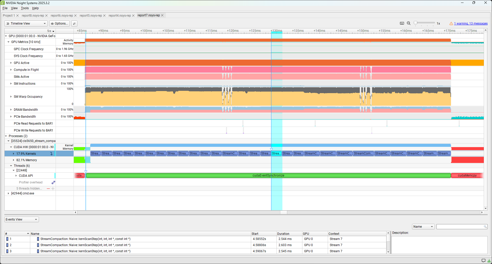
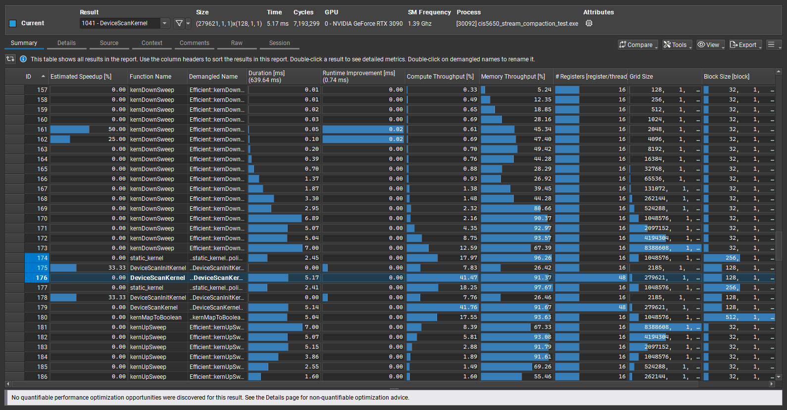

CUDA Stream Compaction
======================

**University of Pennsylvania, CIS 565: GPU Programming and Architecture, Project 2**

* Griffin Evans
  * gpevans@seas.upenn.edu, [personal website](evanses.com/griffin)
* Tested on lab computer: Windows 11 Education, i9-12900F @ 2.40GHz 64.0GB, NVIDIA GeForce RTX 3090 (Levine 057 #1)

# Overview

This project is an implementation and demonstration of several implementations of exclusive scan and stream compaction algorithms. Our scan implementations all take in an array of integers `idata` and output to each index of the array `odata` the sum of all of the values in `idata` with lower indices. Our stream compaction functions take in an array of integers `idata` and output to `odata` an array of the same integers but with all elements that equal 0 removed, returning the number of elements in this resulting array.

Four implementations of scan are featured: the first is a CPU-side implementation which sequentially steps through the input array, then we have 3 GPU-based implementations using CUDA. The first GPU-based implementation (the "naïve" implementation) is based on the non-work-efficient algorithm from Example 2 in [chapter 39 of _GPU Gems 3_](https://developer.nvidia.com/gpugems/gpugems3/part-vi-gpu-computing/chapter-39-parallel-prefix-sum-scan-cuda), while the second GPU-based implementation is based on the work-efficient approach from Examples 3 and 4 in the same chapter. The last GPU-based approach simply leverages the existing Thrust library's implementation of exclusive scan.

Three implementations of stream compaction are featured: the first is a straightforward CPU-based implementation, the second is a CPU-based implementation which divides the process into separate map/scan/scatter steps, and the third is a GPU-based implementation which uses the work-efficient scan implementation alongside GPU-side map and scatter kernels.

Building the project and running `main()` will run each of the implementations on an array of random values, outputting the results and the time each implementation took to run.

## Setup Notes:

I modified stream_compaction/CMakeLists.txt as [described here](https://edstem.org/us/courses/81464/discussion/6937028?answer=16157632); adding `find_package(CCCL REQUIRED)` and `target_link_libraries(stream_compaction CCCL::Thrust)` to fix the thrust library not properly being included.

The process of building the project was as follows:

1. Clone the project to a folder and navigate into it in Bash.
2. `mkdir build`
3. `cd build`
4. `cmake-gui ..`
5. Within CMake GUI, configure the project, selecting Visual Studio 17 2022 as the generator and x64 as the platform.
6. Select "generate".
7. Open the generated `.sln` file within the build folder in Visual Studio.
8. Build the project from the toolbar in Visual Studio.

# Questions and Analysis

## Performance Plots


For smaller array sizes, the CPU implementation is plenty efficient and outperforms both the naïve and work-efficient implementations, while performing slightly slower than the Thrust implementation. TODO

## Work-efficient Parallel Scan Implementation Details (re Part 5)

In order to ensure the work-efficient implementation of scan was performant, a few considerations were made. Firstly note that in both the up-sweep and down-sweep kernels, in order to set the $k$ value (used in the indices of elements to be summed) which ranges from $0$ to $n-1$ (where $n$ is the number of elements in the padded array) in steps of $2^{d+1}$, we take the index of the thread (calculated from `threadIdx`, `blockIdx`, and `blockDim`), compare it to a maximum value and if it is greater than or equal to that value then we return, and if it isn't then we scale that index by multiplying it by $2^{d+1}$ and use that as our $k$. Note that the maximum needs to be compared before the multiplication is done, as otherwise with large enough array sizes we may have our $k$ value overflow and wrap around to a negative value.

For the up-sweep, since the step size $2^{d+1}$ doubles in each iteration, we halve this maximum value each time, starting at $n/2$ as the first step size is $2^{0+1} = 2$. This means in each iteration we have half the number of threads which need to perform work, and the rest of the threads can terminate early upon reaching that maximum index check. Because all of the threads that have work required are sequential in index (their indices starting at 0 and going up by 1 to our maximum index at that step) we should have at most one warp which will have some threads working while others try to terminate early, while all other warps either have all threads doing work or all threads terminating early. In fact since we know the higher-index threads will not have to do any work, we can reduce the number of blocks launched as we reduce this maximum index, such that we completely skip any blocks that would have no threads which actually perform work.

For the down-sweep, as $d$ is now descending and $2^{d+1}$ halves each time, we instead double the maximum value each time, such that the number of threads needing to do work doubles each time, and we similarly increase the number of blocks launched as the number of threads needed increases.

An additional detail which was tested but ultimately is unused in this implementation was the reduction of size of the block once the number of threads needed to launch was low enough that we only had a single block. That is, when the number of threads that will do work is less than the default block size, the kernel would launch with a single block with a number of threads equal to the number of summations that will be done (also tested with that value rounded up to the next multiple of 32, to correspond with the size of warps). This however did not appear to cause any noticeable change in performance, and in testing various default block sizes it was found that starting all of the blocks with 32 threads (the size of a single warp) was most performant for running this implementation of scan on the hardware used&mdash;so since the blocks were single-warp-sized anyway (meaning there'd be no particular benefit to shrinking a block further, since 32 threads would make up the warp anyway), it was not necessary to use this size reduction behavior.

Note that the block size of 32 for work-efficient scan was in constrast to the block sizes found to work best for the naïve implementation of scan and for the other steps of the GPU stream compaction implementation, which all seemed to perform the best with 512 threads per block.


## Nsight analysis


Looking at the timeline for our Thrust-based implementation in NSight Systems, we see a few main periods of activity that seem to be associated with the calls to the Thrust library&mdash;firstly corresponding to the construction of the device vectors, then to the scan function itself, then to the copy operation sending the resulting data to the CPU side.


This section seems to correspond to the construction of the device vectors. We construct two device vectors: `dv_in` which is populated with the elements from `idata` and `dv_out` which is a vector of the same length which will be filled with the results from the scan. We can see in the CUDA API row of Nsight systems a cudaMalloc call followed by a cudaMemcpyAsync call, which seems to correspond to the `dv_in` vector being created and the values from `idata` being copied into it from the CPU. We then have a cudaStreamSynchronize call followed by another cudaMalloc, this time not followed by a copy call as the `dv_out` vector is created with memory allocated to it but no values to be copied into it yet.


That cudaMalloc precedes another cudaStreamSynchronize call, which seems to suggest it is synching to ensure the vectors are done being created before they are used.


We then see cudaEventCreate and cudaEventRecord calls, which match the usage of `timer().startGpuTimer()`, which creates an event to be later used to determine the run time of the function. This is followed by where we call the `thrust::exclusive_scan` function, which seems to correspond to a cudaMalloc call followed by the calling of DeviceScanInitKernel and DeviceScanKernel. 


After a cudaStreamSynchronize we have a cudaFree call before another cudaEventRecord call and a cudaEventSynchronize call, the latter two matching the calling of `timer().endGpuTimer()` and hence letting us see that all of the activity happening between this and the earlier cudaEventRecord is that of the `thrust::exclusive_scan` call. The presence of cudaMalloc and cudaFree within this span seems to suggest the execution of exclusive_scan involves allocating some sort of temporary memory buffer separate from the input and output vectors, unlike our implementations of scan which perform all of their operations directly between the input and output arrays in the case of the naïve implementation and acts in-place in the work-efficient implementation. I would assume this implementation uses shared memory to some degree, as that is a potential improvement which my work-efficient implementation does not account for, but I assume this memory usage here is something different as I believe shared memory usage wouldn't show up as a cudaMalloc call, seeing as `cudaMalloc()` is not the syntax used to allocate it and we allocate it at the launch of the kernel. That's not to say this is a sign the implementation doesn't use shared memory though (I would still guess that it does), but it does seem to imply there is also some other global memory usage in addition to that of the memory occupied by the two device vectors.


The above two images show the execution of the aforementioned DeviceScanInitKernel and DeviceScanKernel, from which we can see that most of the execution time is taken up by the latter. Looking at the SM Warp Occupancy over time, the Compute Warps in Flight throughput percentage is 2% for most of the execution of DeviceScanInitKernel but increases to 82% for most of the DeviceScanKernel's execution&mdash;one can potentially guess that there is some sort of processing done in the "init" kernel which is less parallelizable, and hence we have this kernel do that initial work before starting another kernel which performs more parallelized work with much higher warp occupancy after.


After the event recording is done and we are hence past our `timer().endGpuTimer()` call, we have a final cudaMemcpyAsync for the `thrust::copy` call which takes the data from the `dv_out` device vector and copies it into the CPU-side `odata` which is used to output the overall values from our `scan` function. After another cudaStreamSynchronize (ensuring the copying has finished) we have two cudaFree calls, which seem to be automatically performed by Thrust as it sees that the device vectors are now going to be out of scope and hence can be cleared from memory (compare the usage of something like raw pointers and `std::unique_ptr`&mdash;we don't need to explicitly write out the freeing of memory as we did in our other GPU-side scan implementations as the library does that for us).


For all of the implementations, initial and final memory operations (primarily calls to cudaMemcpy) take take longer than the execution of the algorithm itself, hence being left out of our timing comparisons for the algorithms themselves.



As the naïve implementation here does not vary in number of threads between steps (with threads that aren't summing just copying values from idata to odata, rather than terminating early or not starting at all; the only threads that terminate early are those which have index greater than the total count of elements, i.e. only a few threads in one block and only any if the array size is non-power-of-two), the kernel used by it has a fairly consistent length of execution.


For the work-efficient implementation, the kernels vary in length of execution significantly likely because we both have more threads able to terminate early and we only launch blocks of threads up to the amount required for the work to actually be done in that step. The first calling of the up-sweep kernel takes the longest to complete, then each subsequent step becomes shorter as we reduce the number of threads needed, and inversely the down-sweep kernel starts the shortest then gets longer as we increase the number of threads used.


Note though that because we end up launching very few blocks for many of the steps of the work-efficient implementation, we massively underutilize the GPU's multiprocessors (parallelization doesn't help much when e.g. performing an operation on just one value&mdash;using only a single thread is not really leveraging the GPU's abilities). Hence in the data from Nsight Compute as shown above we can see that though the Memory Throughput ranges from 67.42% to 93.27% for the first few calls of the up-sweep kernel, it begins to drop heavily as we progress, reaching 0.58% at the lowest, while for the down-sweep kernel it starts low (as we start with only a single block with a single thread that has work to do) at 0.98% then gradually increases. Compute Throughput appears relatively low throughout the process, having a max of 12.59% throughout the up and down sweep and being significantly lower at the same times the Memory Throughput is.


The naïve implementation has high Memory Throughput throughout, averaging 92.67%, while the Compute Throughput ranges from 15.27% to 23.30%.



The Thrust implementation has lower Compute and Memory Throughputs in its DeviceScanInitKernel then has high values in each for the DeviceScanKernel&mdash;here having 41.47% and 41.76% Compute Throughput and 91.37% and 91.67% Memory Throughput for executions on arrays of size $2^{29}$ and $2^{29}-3$ respectively. While the Compute Throughput is still much less than the Memory Throughput, it is far greater than in either of our implementations.

Given all of these implementations have consistently higher Memory Throughput than Compute Throughput, I would suppose memory to be the main bottleneck&mdash;though in the case of the low-threadcount sections of the work-efficient approach, the GPU's resources are being underutilized to an extent where this is not so relevant to the overall performance (though for the first few up-sweeps and last few down-sweeps the performance still appears memory-bound).

## Program Output:

I didn't add any additional tests to the output here, but I did test compact with arrays not ending in 0, whereas the base test always ended them with 0&mdash;this was significant as the use of exclusive scan means the final value in the indices array is equal to the total count of non-zero elements if the final element is 0, but otherwise is 1 less than the total count, so I needed to make sure my implementation handled this case correctly (but since it doesn't particularly affect performance, I did not take separate metrics for it for it).

With array size 2^24:
```
Array Size 2^24

****************
** SCAN TESTS **
****************
    [  33  14  48   6  37  31  38  47  49  45   1   8  38 ...  36   0 ]
==== cpu scan, power-of-two ====
   elapsed time: 26.9298ms    (std::chrono Measured)
    [   0  33  47  95 101 138 169 207 254 303 348 349 357 ... 410991594 410991630 ]
==== cpu scan, non-power-of-two ====
   elapsed time: 26.3172ms    (std::chrono Measured)
    [   0  33  47  95 101 138 169 207 254 303 348 349 357 ... 410991573 410991580 ]
    passed
==== naive scan, power-of-two ====
   elapsed time: 4.8169ms    (CUDA Measured)
    passed
==== naive scan, non-power-of-two ====
   elapsed time: 4.69709ms    (CUDA Measured)
    passed
==== work-efficient scan, power-of-two ====
   elapsed time: 2.28694ms    (CUDA Measured)
    passed
==== work-efficient scan, non-power-of-two ====
   elapsed time: 2.09229ms    (CUDA Measured)
    passed
==== thrust scan, power-of-two ====
   elapsed time: 0.608256ms    (CUDA Measured)
    passed
==== thrust scan, non-power-of-two ====
   elapsed time: 0.741376ms    (CUDA Measured)
    passed

*****************************
** STREAM COMPACTION TESTS **
*****************************
    [   1   2   0   2   3   0   2   2   2   1   1   2   3 ...   3   0 ]
==== cpu compact without scan, power-of-two ====
   elapsed time: 31.3233ms    (std::chrono Measured)
    [   1   2   2   3   2   2   2   1   1   2   3   1   1 ...   1   3 ]
    passed
==== cpu compact without scan, non-power-of-two ====
   elapsed time: 32.9821ms    (std::chrono Measured)
    [   1   2   2   3   2   2   2   1   1   2   3   1   1 ...   1   2 ]
    passed
==== cpu compact with scan ====
   elapsed time: 65.5021ms    (std::chrono Measured)
    passed
==== work-efficient compact, power-of-two ====
   elapsed time: 2.65523ms    (CUDA Measured)
    passed
==== work-efficient compact, non-power-of-two ====
   elapsed time: 2.58253ms    (CUDA Measured)
    passed
Press any key to continue . . .
```
